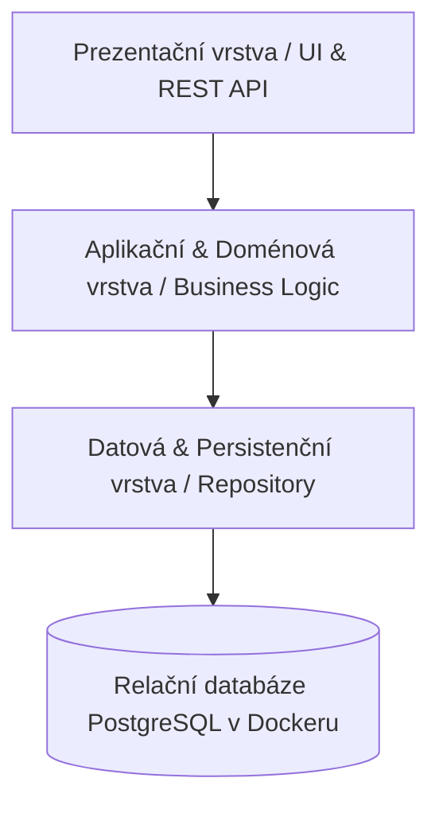
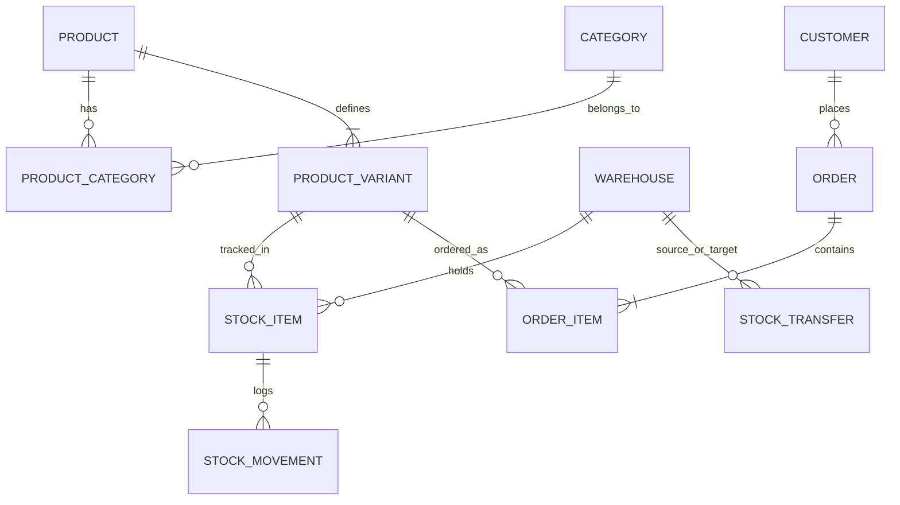

# Sklad pro malý e-shop (Dřevěnka s.r.o.)

> **Předmět:** Pokročilé programování (PPRO), ZS 2026/2027, FIM UHK  
> **Zadání:** B – Sklad pro malý e-shop  
> **Klient:** Petr Doležal, Dřevěnka s.r.o.  
> **Autor projektu:** Marek Ludvík ([@M4reg](https://github.com/M4reg))  
> **Repozitář:** [https://github.com/M4reg/ppro2026.git](https://github.com/M4reg/ppro2026.git)  
> **Tento dokument je jediným zdrojem pravdy (Single Source of Truth) pro zadání, technickou dokumentaci a architektonická rozhodnutí projektu.**

---

## 1. Kontext klienta a současný stav

### O klientovi
Pan Petr Doležal podniká deset let v oboru výroby a prodeje dřevěných hraček pod firmou **Dřevěnka s.r.o.**. Poslední tři roky firmě dynamicky rostou tržby a stávající způsob evidence přestal dostačovat.

### Současný stav (problémy a bolestivá místa)
- **Jeden sdílený soubor v Excelu** se zhruba 400 položkami, který mají zároveň otevřený tři lidé na třech počítačích (dochází k přepisování a zamykání).
- **Dva fyzické sklady:**
  1. *Hlavní sklad v Hradci Králové* (centrála, primární expedice).
  2. *Sklad v Třebechovicích pod Orebem* (fakticky garáž sloužící pro odkládání sezónního zboží a přebytků).
- **Ruční přepisování:** Objednávky z e-shopu přicházejí e-mailem a pracovníci je ručně přepisují do Excelu.
- **Kritická chybovost:** Přibližně dvakrát do měsíce dojde k prodeji zboží, které reálně není skladem. Následné telefonické omluvy zákazníkům a rušení/úpravy objednávek představují nejhorší část práce pana Doležala.
- **Neevidované přesuny:** Jednou za čas se zboží převáží z garáže v Třebechovicích do Hradce, avšak tyto fyzické přesuny se nikde nezaznamenávají.
- **Nespolehlivý stav:** V garáži stav zásob v tabulce „nikdy nesedí“.

---

## 2. Specifikace požadavků

### 2.1 Co klient chce (funkční požadavky)
1. **Produkty a kategorie:**
   - Každý produkt má název, kód (SKU), popis, nákupní cenu a prodejní cenu.
   - Možnost zařazení do více kategorií současně (vazba M:N – např. jedna dřevěná káča patří do kategorií *„pro batolata“* i *„dárky do 500 Kč“*).
2. **Zásoby po skladech:**
   - U každého produktu a jeho varianty přehledně vidět, kolik kusů se nachází v Hradci a kolik v garáži v Třebechovicích.
3. **Objednávky zákazníků:**
   - Evidence zákazníka, data vytvoření, aktuálního stavu a jednotlivých položek.
   - U každé položky objednávky je uloženo množství a jednotková prodejní cena platná v okamžiku prodeje.
4. **Odmítnutí objednávky při nedostatku zásob:**
   - Systém musí zabránit přijetí či potvrzení objednávky, na kterou nejsou k dispozici volné zásoby.
5. **Dohledání pohybu (auditní stopa):**
   - Ke každému výdeji a příjmu musí být zřejmé, z jakého skladu byl proveden, kdy a v souvislosti s čím (např. zodpovězení dotazu: *„Kde je ta káča, co jsem ji měl minulý týden?“*).
6. **Přesun mezi sklady:**
   - Samostatně evidovaný proces převozu zboží mezi sklady (vyskladnění v Třebechovicích ➔ naskladnění v Hradci).
7. **Minimální zásoba a doporučení k doobjednání:**
   - Definice minimální bezpečné hladiny zásob u produktů.
   - Přehled položek pod tímto minimem zobrazený přímo na úvodním dashboardu.
8. **Měsíční obrat po kategoriích:**
   - Manažerský přehled o tržbách za zvolený měsíc rozpadlý dle jednotlivých kategorií produktů (*„co firmu živí“*).

### 2.2 Na čem klient trvá (obchodní pravidla vynucená systémem)
- **Zákaz výdeje do záporu:** Vydat ze skladu více kusů, než je aktuálně k dispozici, nesmí systém za žádných okolností umožnit (ani ručně, ani omylem).
- **Neměnnost historických cen:** Pokud dojde k úpravě ceníku produktu, cena v již odeslaných/vytvořených objednávkách musí zůstat nedotčena.
- **Plná dohledatelnost každé změny stavu:** Každá změna skladového množství musí být doložitelná konkrétním pohybem (*„Proč jich je na skladě 17 a ne 20?“*).
- **Zákaz mazání zákazníků:** Zákazníci se z databáze nemažou, neboť se ke svým objednávkám vracejí s dotazy, novými nákupy a případnými reklamacemi.

### 2.3 Co klient prohodil mimochodem (doplňková přání)
- **Poštovné:** Systém v této fázi nepočítá poštovné (řeší e-shop).
- **Mobilní použitelnost:** Rozhraní musí být responzivní a ergonomicky přizpůsobené pro obsluhu z mobilního telefonu/tabletu přímo mezi regály ve skladu.
- **Fakturace:** V první verzi se faktury nevystavují, architektura však musí umožnit budoucí napojení.
- **Barevné kódování:** Rychlá vizuální indikace na dashboardu (červené/oranžové zvýraznění produktů pod minimální zásobou a hořících termínů).

---

## 3. Oddíl Rozhodnutí (Architektonická rozhodnutí k otevřeným bodům)

V souladu s metodikou předmětu PPRO jsou zde zaznamenána klíčová rozhodnutí k neujasněným bodům zadání:

### Rozhodnutí 1: Objednávka vyžadující zboží ze dvou skladů
- **Problém:** Klient váhá, jak postupovat, když část položek objednávky je v Hradci a část v sezónní garáži v Třebechovicích (s ohledem na poštovné a logistiku).
- **Rozhodnutí:** Objednávka se vždy expeduje jako jeden balík z hlavního skladu v Hradci Králové. Pokud je požadované zboží dostupné pouze v Třebechovicích, systém při potvrzení objednávky automaticky vygeneruje **Interní požadavek na přesun mezi sklady** (Třebechovice ➔ Hradec). Expedice zákazníkovi proběhne až po naskladnění v Hradci. Zákazník tak neplatí dvojí poštovné a proces výdeje zůstává přehledný.

### Rozhodnutí 2: Kde se návrh láme – Okamžik odečtení zásoby a co znamená „dost zásob“
- **Problém:** Není zřejmé, zda „dost zásob“ znamená fyzický stav na regále, nebo stav ponížený o otevřené objednávky, a v jaké fázi se zásoba reálně odepisuje.
- **Rozhodnutí:** Zavádíme striktní dvoustupňový model zásob:
  $$\text{Disponibilní zásoba} = \text{Fyzická zásoba na skladě} - \text{Rezervace v rozpracovaných objednávkách}$$
  - **Okamžik přijetí objednávky:** Systém ověřuje disponibilní zásobu. Pokud je dostatečná, dojde k **okamžité rezervaci** zboží. Nedojde-li k pokrytí, objednávka je ihned odmítnuta / neprojde do stavu k vyřízení.
  - **Okamžik fyzické expedice:** Teprve při zabalení a odeslání zásilky se ruší rezervace a zapisuje se **fyzický výdejový skladový pohyb**, který sníží fyzický stav na skladě.
  - Tímto je garantováno, že se nikdy neprodá zboží, které již bylo slíbeno jinému zákazníkovi, a zároveň fyzický stav odpovídá realitě na regálu až do expedice.

### Rozhodnutí 3: Záporný stav a nesrovnalosti v garáži (inventury)
- **Problém:** V garáži stav často nesedí a hrozí riziko záporného čísla.
- **Rozhodnutí:** Fyzický stav v databázi má integritní omezení `CHECK (quantity >= 0)`. Záporný stav je systémem striktně zakázán. Nesrovnalosti se řeší modulem **Inventura**: oprávněný pracovník zadá skutečně napočítaný stav, systém spočítá rozdíl a automaticky vytvoří auditní pohyb typu `INVENTORY_DISCREPANCY` (manko / přebytek) s povinným textovým odůvodněním a identitou provádějícího uživatele.

### Rozhodnutí 4: Varianty produktu
- **Problém:** Klient mluví o „té samé káče ve třech barvách“ a nerozlišuje mezi samostatným produktem a variantou.
- **Rozhodnutí:** Zvolen hierarchický model **Produkt ➔ Produktová varianta (SKU)**:
  - *Produkt* nese obecný název, popis a příslušnost ke kategoriím (např. „Dřevěná káča klasická“ v kategoriích *Hračky* a *Dárky*).
  - *Varianta* nese specifický unikátní kód (např. `KACA-CERV`, `KACA-MODR`), konkrétní nákupní a prodejní cenu a samostatnou evidenci skladových zásob po skladech. V případě produktů bez variant existuje implicitní výchozí varianta.

### Rozhodnutí 5: Změna objednávky po zaplacení
- **Problém:** Zákazníci občas telefonicky volají a chtějí objednávku upravit i po zaplacení.
- **Rozhodnutí:** Úprava objednávky operátorem je povolena pouze ve stavech před zahájením fyzické expedice (stavy `PŘIJATO`, `ZAPLACENO`). Při změně položek systém zvaliduje disponibilní zásoby a aktualizuje rezervace. Vznikne-li finanční rozdíl, systém jej eviduje jako přeplatek/nedoplatek s vazbou na objednávku. Po přechodu do stavu `EXPEDOVÁNO` je objednávka uzamčena pro úpravy a případné požadavky se řeší standardním procesem vratky/reklamace.

---

## 4. Architektura a technický návrh

Projekt je navržen v souladu s požadavky semestrální práce PPRO:
- **Třívrstvá architektura se závislostmi jedním směrem:**
  1. **Prezentační vrstva:** Webové rozhraní / REST API (ergonomické, responzivní pro mobilní skladníky i desktopovou kancelář).
  2. **Aplikační a doménová vrstva:** Zapouzdření veškerých obchodních pravidel, validací, kalkulace disponibilních zásob a stavových přechodů objednávek.
  3. **Datová / Persistenční vrstva:** Přístup k relační databázi, transakční zpracování skladových operací.



### 4.1 Datový model (minimálně 5 entit a M:N vazba)

Systém pokrývá bohaté doménové schéma překračující povinné minimum:
1. `Category` – kategorie produktů (stromová či plochá struktura).
2. `Product` – obecný produkt (název, popis).
3. `ProductCategory` – **vazební tabulka M:N** spojující produkty a kategorie.
4. `ProductVariant` – konkrétní prodejní položka (SKU kód, nákupní cena, výchozí prodejní cena, atributy např. barva/velikost).
5. `Warehouse` – sklad (Hradec Králové, Garáž Třebechovice).
6. `StockItem` – stav zásob konkrétní varianty na konkrétním skladě (fyzické množství, rezervované množství, minimální doporučená zásoba).
7. `StockMovement` – neměnný auditní log každého pohybu (typ: Příjem, Výdej, Přesun z/do, Inventurní vyrovnání; množství, datum, sklad, uživatel, reference na objednávku/přesun).
8. `Customer` – zákazník (jméno, e-mail, telefon, adresa, poznámky; zákaz fyzického mazání).
9. `Order` – objednávka (číslo objednávky, zákazník, datum, stav: Nová, Rezervováno, Zaplaceno, Expedováno, Zrušeno).
10. `OrderItem` – položka objednávky (vazba na variantu, objednané množství, historická prodejní cena snapshotem).
11. `StockTransfer` – doklad o mezi-skladovém přesunu zboží.



---

## 5. Povinné minimum a jeho plnění

| Požadavek z kurzu PPRO | Stav v projektu | Způsob řešení |
| :--- | :---: | :--- |
| **Třívrstvá architektura** | Splněno (v návrhu) | Přísně oddělená Prezentační, Doménová a Datová vrstva se závislostmi jedním směrem. |
| **Relační databáze v Dockeru** | Splněno (v návrhu) | Databáze (PostgreSQL) běží v Docker kontejneru definovaném v `docker-compose.yml`. |
| **Databázové migrace** | Splněno (v návrhu) | Řízení schématu verzovanými migračními skripty. |
| **Minimálně 5 entit** | Splněno (v návrhu) | Navrženo 11 entit plně pokrývajících doménu skladu. |
| **Alespoň jedna vazba M:N** | Splněno (v návrhu) | Realizována vazba mezi `Product` a `Category` (a vazby objednávek). |
| **Automatizované testy** | Splněno (v návrhu) | Testy klíčových obchodních pravidel (výdej nad zásobu, neměnnost cen, audit). |
| **Spuštění přes docker compose up**| Splněno (v návrhu) | Projekt bude plně spustitelný jediným příkazem `docker compose up`. |
| **Technická dokumentace** | Splněno | [README.md](file:///u:/ppro2026/README.md) slouží jako jediný zdroj pravdy. |
| **Syntetická data bez hesel** | Splněno | V repozitáři jsou pouze anonymní testovací data, citlivé údaje řešeny přes environmentální proměnné. |

---

## 6. Provoz a spuštění projektu

### Požadavky
- Docker & Docker Compose
- Git

### Spuštění
```bash
# Klonování repozitáře
git clone https://github.com/M4reg/ppro2026.git
cd ppro2026

# Spuštění celého systému včetně databáze a migrací
docker compose up --build
```

---

## 7. Deník změn a rozhodnutí (Changelog & Progress Log)

- **2026-09-30:**
  - Výběr Zadání B (Sklad pro malý e-shop – Dřevěnka s.r.o.).
  - Inicializace Git repozitáře a propojení na GitHub `https://github.com/M4reg/ppro2026.git`.
  - Vytvoření [AGENTS.md](file:///u:/ppro2026/AGENTS.md) s pravidly pro AI asistenta (zákaz automatického pushování, povinné přepínače `-m`, synchronizace dokumentace).
  - Vytvoření [README.md](file:///u:/ppro2026/README.md) jako jediného zdroje pravdy: detailní specifikace požadavků, vyřešení všech otevřených bodů (oddíl Rozhodnutí) a návrh třívrstvé architektury.
  - Zavedení Git hooků pro kontrolu a garanci udržování technické dokumentace a ochranu před nechtěným pushem.
